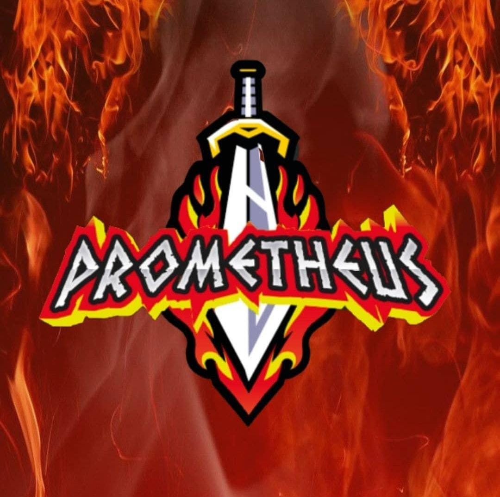
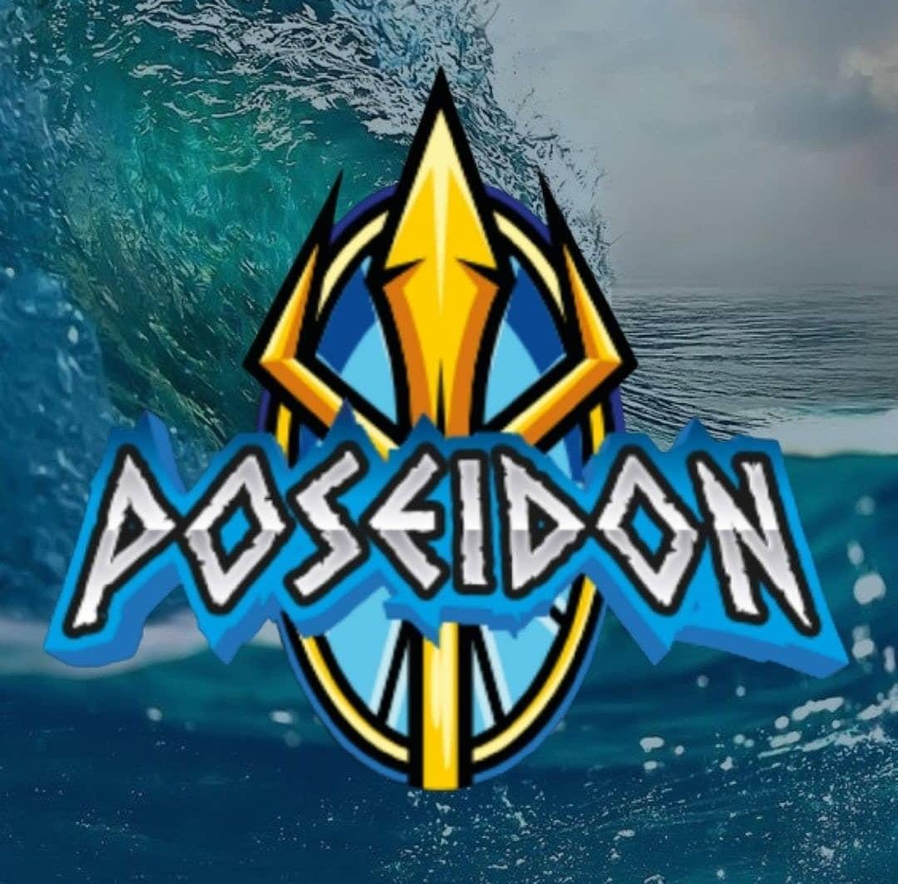
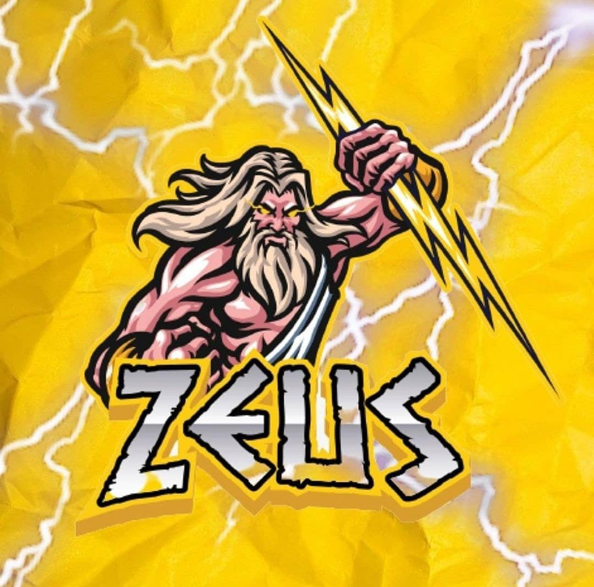

# ETAPAS DE OLIMPO  
GYM OLIMPO no es un simple gimnasio que solo se en carga del cuerpo si no de la mente te ayuda a crecer tanto en lo fisico como en la 
personalidad. 
Olimpo tiene cinco etapas que son:  

**AEOLO**  
**GEA**  
**PROMETHEUS**  
**POSEIDON**  
**ZEUZ**  

CADA ETAPA REPRESENTA UNA PARTE DEL CUERPO Y UNA ENSEÑANZA  

| **AEOLO (SABIDURIA)** | SIGNIFICADO |
| ---- | ---- |
| CREATIVIDAD | ---- |
| LIBERTAD | ---- | 
| IMAGINACION | ---- |
| PARTE DEL CUERPO EN CARGADA | MENTE |

| **GEA (ESTABILIDAD)** | SIGNIFICADO |
| ---- | ---- |
| FUERZA | ---- |
| DISCIPLINA | ---- |
| RESPONSABILIDAD | ---- |
| PARTE DEL CUERPO EN CARGADA | PIERNAS | 

| **PROMETHEUS (VALENTIA)** | SIGNIFICADO |
| ---- | ---- |
| PASION | ---- |
| LIDERAZGO | ---- |
| INTUICION | ---- |
| PARTE DEL CUERPO EN CARGADA | PECHO |

| **POSEIDON (HUMILDAD)** | SIGNIFICADO |
| ---- | ---- |
| EMPATIA | ---- |
| SENSIBILIDAD | ---- |
| AMOR | ---- |
| PARTE DEL CUERPO EN CARGADA | BRAZO | 

| **ZEUZ (PODER)** | SIGNIFICADO |
| ---- | ---- |
| SABIDURIA | AEOLO |
| ESTABILIDAD | GEA |
| VALENTIA | PROMETHEUS |
| HUMILDAD | POSEIDON |

