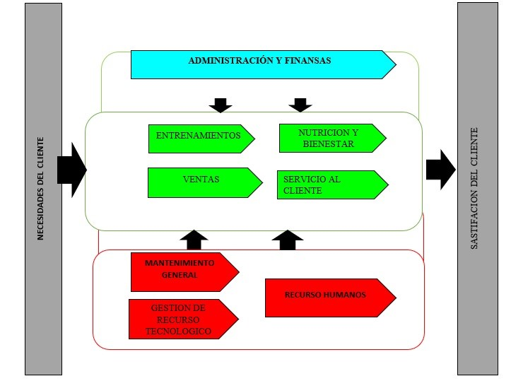
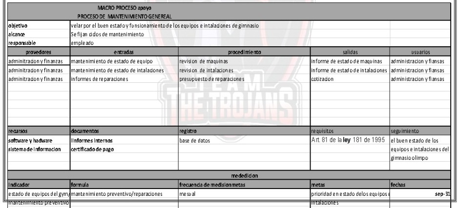
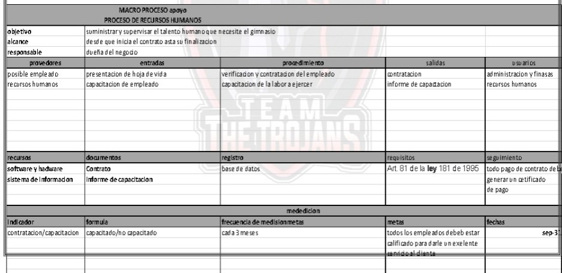
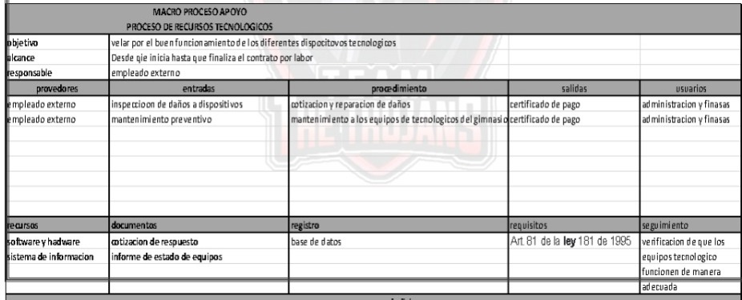
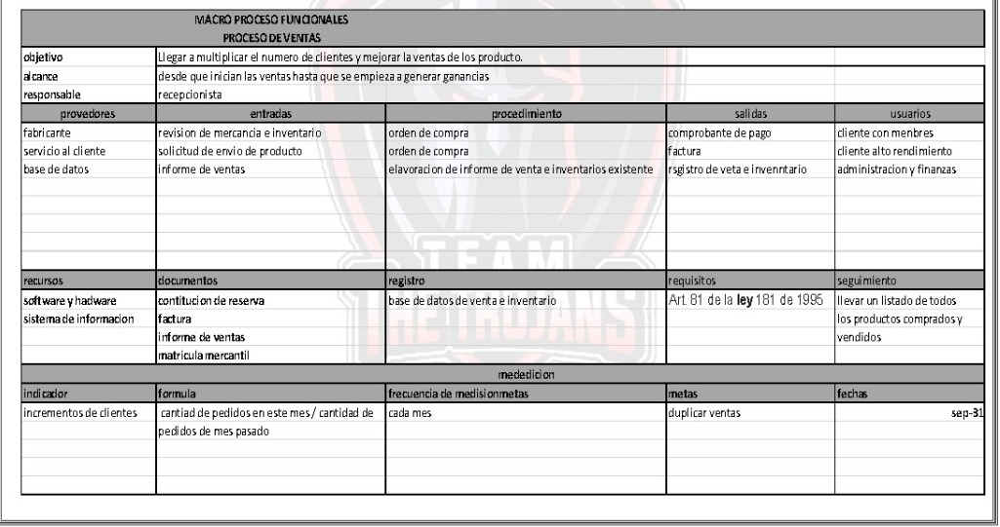
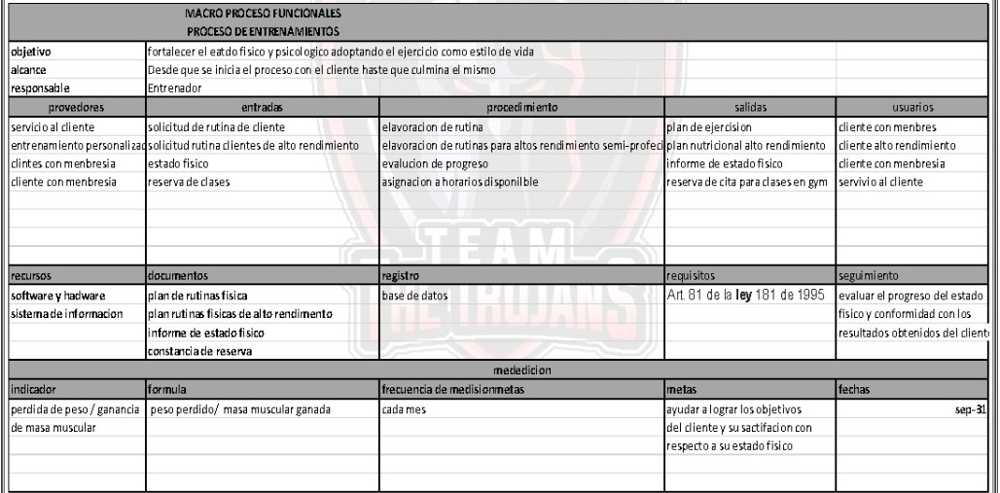
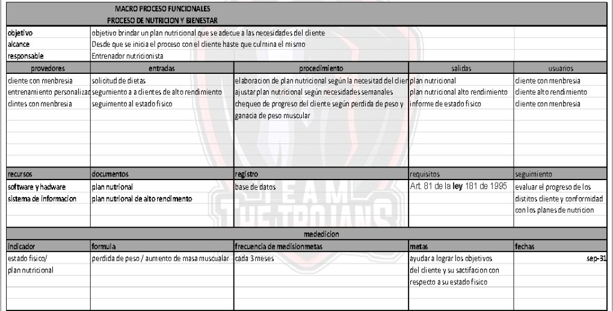
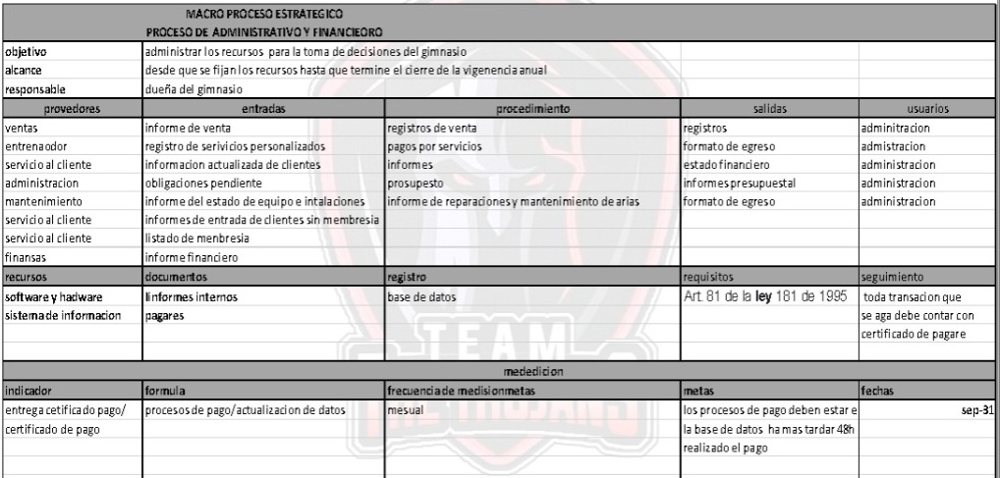

# mapa de proceso 

***Mejoramiento: gimnasio olimpo*** 

El gym olimpo es un centro de acondicionamiento físico de alta motivación, especialista en procesos personalizados y al pendiente de su nutrición. Pretende ser accesible a las necesidades de las personas, brindándoles posibilidades para mejorar tanto físicamente como psicológicamente  
Se busca ser muy estricto con la gestión de mantenimiento y desarrollar un método a través de gestión de recursos tecnológicos para la facilidad y control de la gestión financiera y también la facilidad para los usuarios y clientes de ver y resolver cualquier inquietud. 

***IDENTIFICACION DE PROCESOS*** 

- Administración  y finanzas 
- Servicio al cliente 
- Entrenamientos personalizados 
- Nutricion y bienestar 
- Mantenimiento genera<brl
- Gestión de recurso tecnológico 
- Ventas. 

***Clasificación de procesos***

**Estratégico**

	Administración y finanzas 

**Funcionales**

o	Servicio al cliente 
o	Entrenamientos 
o	Nutricion y bienestar  
o	Ventas 

**Apoyo**

•	Mantenimiento general 
•	Gestión de recurso tecnológico 
•	Recursos humanos 

## MAPA DE PROCESO

### CARACTERIZACION DE PROCESO

