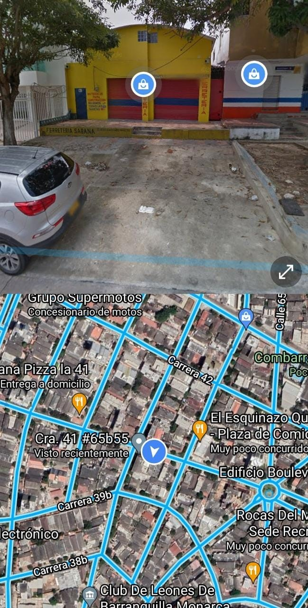

# Definicion de proyecto

### ANALISIS DISEÑO Y DESARROLLO DE UN APLICATIVO WEB PARA SISTEMATIZACION OPTIMA DE LA INFORMACION DEL GIMNASIO GYM OLIMPO.

## Tabla de contenido

-	Introducción                                                                          
-	Historia de Revisiones                                                         
-	Objetivo	                                                                         
-	Aspectos a documentar                                                        
1.	Ubicación contextual del  
proyecto                                      
    2.   Problema u Oportunidad.                                                    
    3.   Visión del proyecto.                                                           
    4.   Objetivos específicos del
         proyecto                                                               
    5.   Criterios de éxito                                                               
    6.   Viabilidad de la solución                                                   
       6.1. Viabilidad del Negocio                                                 
       6.2. Viabilidad Técnica                                                         
       6.3. Viabilidad del proyecto                                                  
       6.4. Acciones propuestas  

# Historial de revisiones

| Fecha | Versión | Descripción/cambio | Autor |
| ----- | ------- | ------------------ | ----- |
| 16/SEP/2021 | 1 | CREACION | THE TROJANS |

# Introducción

Este es un proyecto que busca satisfacer las necesidades del GYM OLIMPO. Analizando, diseñando y desarrollando un sistema de información que cumplan con los requisitos y las necesidades del gimnasio olimpo, a través de un aplicativo web para el manejo de las ventas e información

## Objetivo

- Mejoramiento de la representación de los logros obtenidos por los clientes en el GIMNACIO gym olimpo.

- Sistematización de la información de rutinas y logro de los clientes.

- crear una plataforma del gimnasio donde estén todos los integrantes como instructores para la mejor comunicación.

-  mayor publicidad para dar más a conocer sobre lo que es el gym olimpo.

- Satisfacer las necesidades de tanto clientes como gerentes e instructores.

# Aspectos a documentar

## 1. Ubicación contextual del proyecto.

- CARRERA 41 #65B-55, BARRANQUILLA, ATLANTICO

## 2. Problema u Oportunidad.

Dentro de este proyecto  también el deporte tiene problemas las cuales suelen encontrarse  en el  empresario ya sea con la falta de capacidad de  hacer crecer el negocio, ya que todo esto depende de unas estrategias para poder llevarlo hacia delante  para esto necesitaríamos una  planificación para establecer una series de objetivos a los que hay que llegar en un determinado plazo también crear nuevas estrategias para nuevos usuarios unas de las grandes  causas que frenan el crecimiento de esta ya sea faltas de estrategias , faltas de resultados, no tener una web donde poder mostrar su ubicación y sus contenidos  y una formación como básica en gestiones de proyecto por lo tanto para para oportunidades podemos decir que es una adaptación a nueva tecnologías de posibilidades de colaboración con competencia también de obtener productos para el consumidor , unas aperturas de campaña publicitaria, equipos en buen estado, flexibilidad de horarios, paquetes de promoción ya que la demandas en los gimnasio es cada vez mayor ya que la población en su mayoría los jóvenes se preocupan  más por su salud y aspecto físico estos factores indican que la gente acude con más frecuencia al gimnasio ya sea con acuerdos con  empresas o nuevas tendencias de ejercicio en esta serian (zumba, spinning yoga , pilates ,etc.)

## 4. Objetivos específicos del proyecto.

Desarrollar un sistema información que le permita al gimnasio mejorar la manipulación de los datos de cada cliente. También que el sistema le mandó un mensaje para que le indique cuándo se va a reunir dónde se van a reunir y a qué hora se van a reunir.

## 5. Criterios de éxito.

Dentro de nuestros criterios de éxito tendremos el acompañamiento de nuestros instructores que nos aconsejaran y orientaran en la creación de un sistema de información que satisfaga las necesidades de nuestros clientes. También contaremos con la disponibilidad de herramientas tecnológicas, además, contaremos con la cooperación y compromiso del equipo y dueño del gimnasio para mejorar las condiciones físicas de nuestros usuarios, de manera que tanto nosotros como nuestro cliente este feliz con el resultado.

## 6. Viabilidad de la solución.

### Viabilidad del Negocio.

Ya con la finalización de este proyecto el negocio contara con una plataforma web que tendrá los perfiles de los miembros del negocio en este caso GYM OLIMPO contara con un rendimiento mucho mayor con el que venía trabajando esto hace mejore en el área administrativa teniendo un mejor manejo con los usuarios, con el tiempo u con el área contable.
Y como este proyecto es totalmente gratuito no tiene ningún costo y supervisado por experto en el área de la programación que nos estarán asesorando en todo momento.  

### Viabilidad Técnica.

Contamos con los recursos y conocimiento en la parte técnica para la elaboración del sistema de información para GYM OLIMPO que tendrá todo lo relacionado a este negocio como información del cliente de cuál será su horario de ejercicio y la información de su membresía eso ayudará tanto al cliente como la empresa a su crecimiento. También contamos con técnica de recolección de datos como son los cuestionarios ahora mismo contamos con dos cuestionarios diferentes uno para los clientes y otro para los instructores que son:

#### Formulario para clientes.

- [CUESTIONARIO PARA CLIENTES](olimpo/cuestionario/formulario-clientes.md)

#### Formulario para instructores.

- [CUESTIONARIO PARA INSTRUCTORES](olimpo/cuestionario/formulario-instructor.md)

### Viabilidad del proyecto.

Este proyecto no tiene repercusiones económicas ya que es totalmente gratis eso hace que sea bueno para la implementación de dicho proyecto que ayudara al crecimiento del GYM, si tiene éxito este proyecto lo ayudara e la pare estructural haciendo que los clientes tengan más comodidad al momento de utilizar las plataformas y es mucho más rápido lo cual hace que el trabajo de atención a los clientes se duplique y que genere más ingreso.

### Acciones propuestas.

Se propone un aplicativo web para mejorar la estabilidad bajo un comando de los estudiantes del Sena, que está haciendo supervisado bajo la autoridad de los instructores, calificados del Sena que a su vez li rinden cuentas al ministerio de educación por dicho proyecto.
También, se puede decir que otra propuesta seria que si el aplicativo web o de escritorio no diera los resultados esperados hacer un aplicativo móvil.
